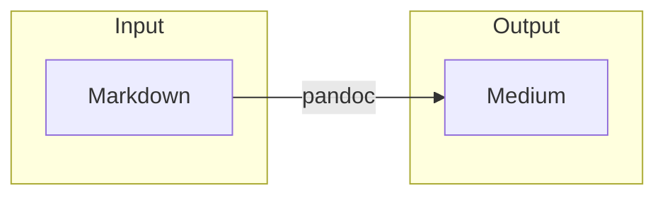

# Example markdown file
With different features that we want to be able to export to Medium.

## Text 

Different _styles_ of **text** including [links](https://blog.esciencecenter.nl).

- Bullet
- Points
  - Sometimes
      - Nested

1. Numbered
2. Lists

## Images

### Local


### Remote


## Equations

### Inline
Did you know $i^2 = -1`$?

### Standalone
$$
e^{i \pi} = -1
$$

## Code

### Inline
Run `ls` to see a list of your files.

### Codeblocks

#### Python
```python
def identity(x):
  return x
```

#### R
```r
identity <- function(x) {
  return(x)
}
```

## Diagrams


## Footnotes
A very needed feature[^1].

[^1]: at least in academic texts.